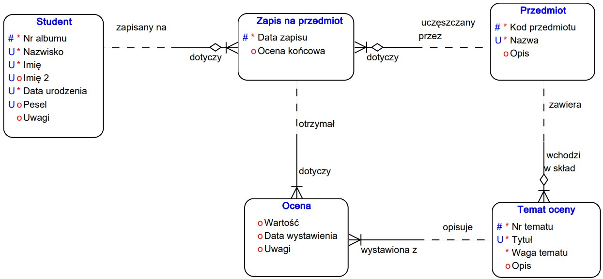
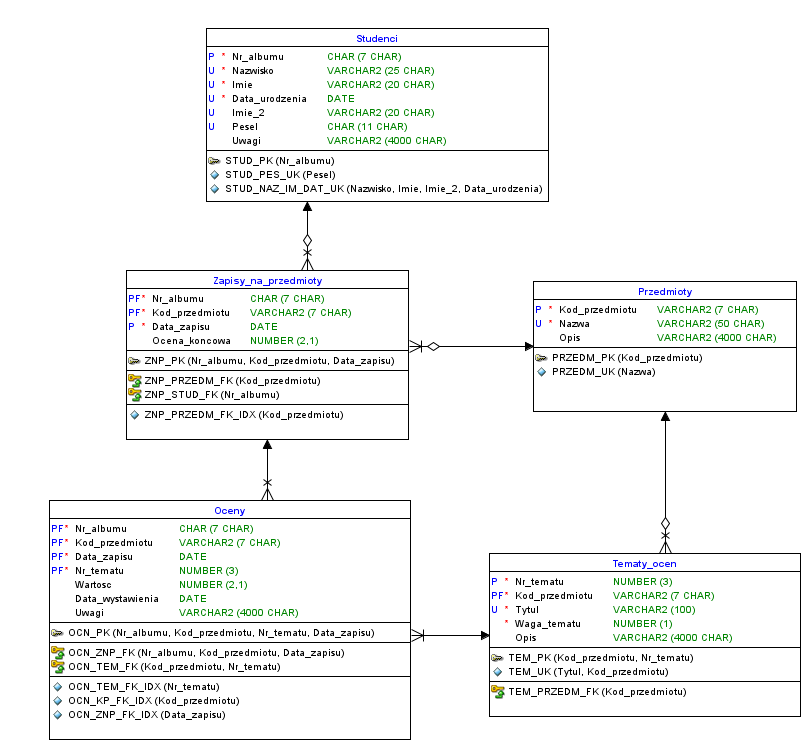

## Tools
Relational database project created for `oracle` database using: 
* **datamodeler**: structure design 
* **sqldeveloper**: connection to the base

## ERD model created in barker notation:

## Relational structure:

